**Student:** FOKEMG-YALIE Brisco Elias  
**Registration Number:** 2026/FCDF/16853  
**Course:** WADF105: Network Security Fundamentals    
**Submission deadline:** October 06, 2026, 23:59 WAT
**International Cybersecurity and Digital Forensics Academy (ICDFA)**

# Lab 2: OPNsense Firewall Policy Testing, Logging and Packet Analysis

## Scenario and objectives

This practical laboratory uses the network commissioned in Lab 1: the Ubuntu workstation `icdfa-nslab-client-v1` and the OPNsense firewall `icdfa-nslab-firewall-v1`.

The task was to establish a baseline, create two narrow firewall rules, test their effects, examine firewall logs, compare the results with Wireshark packets, inspect states and outbound NAT, and disable the temporary rules at the end. All rule changes were limited to the authorised ICDFA laboratory firewall.

| Component | Laboratory configuration |
|---|---|
| Firewall WAN | VirtualBox NAT |
| Firewall LAN | Internal Network `ICDFA-LAN`, `10.10.10.1/24` |
| Ubuntu client | Internal Network `ICDFA-LAN`, observed address `10.10.10.2/24` |
| Ubuntu Ethernet interface | `enp0s3` |
| Ubuntu default gateway | `10.10.10.1` |

## Part A: Record the baseline

### Addressing and routing

I recorded the Ubuntu address and default route with:

```bash
ip -4 -br address
ip route
```

The output shows `enp0s3` in the `UP` state with address `10.10.10.2/24`. The default route points to `10.10.10.1` through `enp0s3`.

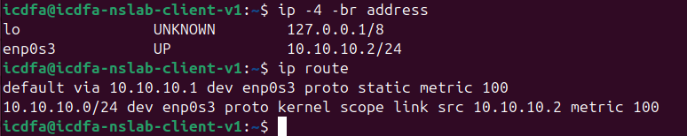

*Ubuntu IPv4 configuration and routing table before policy testing.*


### DNS resolution

```bash
getent hosts example.com
```

The command returned IPv6 addresses for `example.com`, demonstrating successful name resolution. Returning IPv6 records does not itself demonstrate IPv6 connectivity.

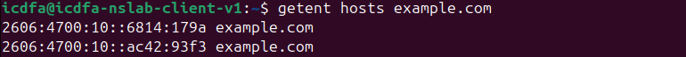

*Baseline name-resolution results for example.com.*


### HTTP and HTTPS

```bash
curl -I http://example.com
curl -I https://example.com
```

Before the restrictions, HTTP returned `HTTP/1.1 200 OK`, and HTTPS returned `HTTP/2 200`. These results establish that both web tests worked before the temporary rules were introduced.

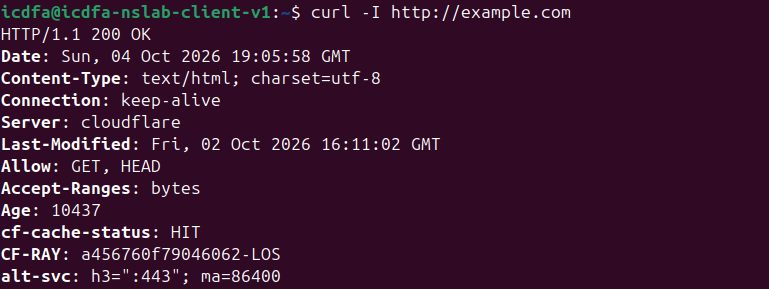

*Successful baseline HTTP response from example.com.*

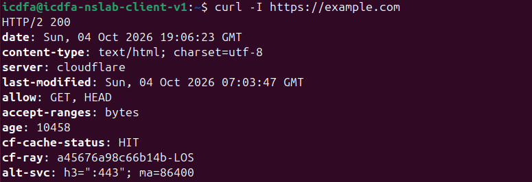

*Successful baseline HTTPS response from example.com.*


The brief also requests a baseline `ping -c 4 1.1.1.1`; a baseline ping screenshot is not included in the supplied Lab 2 images.

## Part B: Review rule order

I inspected **Firewall → Rules → LAN** and located the default LAN allow rules. The specific temporary block rules were placed above the broad default IPv4 allow rule.

For the quick interface rules used in this exercise, a matching block rule stops processing before the traffic reaches the broad allow rule. The existing default allow rules were retained.

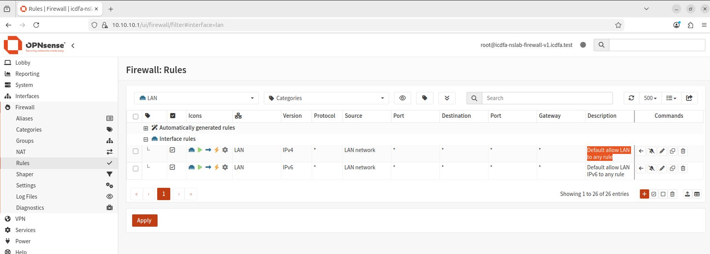

*Initial LAN rules showing the default IPv4 and IPv6 allow rules.*


## Part C: Block ICMP to one test address

I created the rule named `LAB2 BLOCK ICMP TO 1.1.1.1`.

| Rule field | Setting used for the laboratory test |
|---|---|
| Action | Block |
| Interface and direction | LAN, In |
| IP version | IPv4 |
| Protocol | ICMP |
| Source | LAN network |
| Destination | `1.1.1.1/32` |
| Logging | Enabled; matching entries appear in Live View |
| Description | `LAB2 BLOCK ICMP TO 1.1.1.1` |

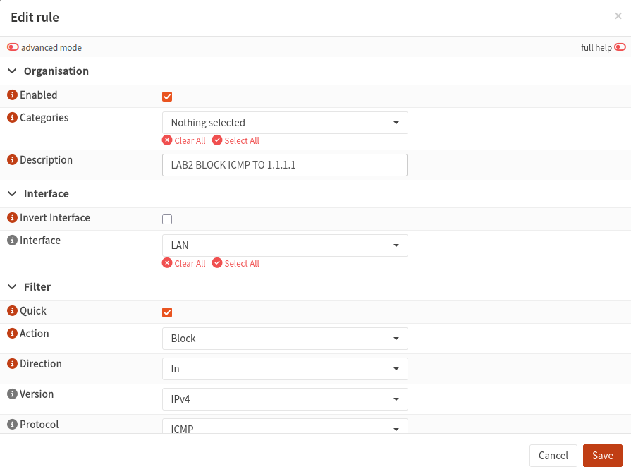

*ICMP rule editor showing the enabled LAN IPv4 block rule with Quick selected.*

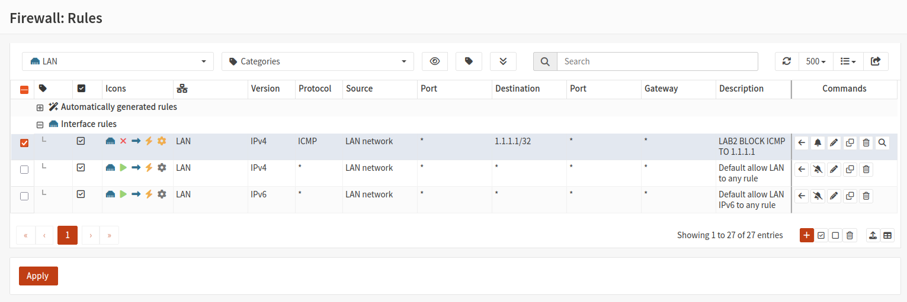

*ICMP block rule positioned above the default LAN allow rules.*


I tested the rule from Ubuntu:

```bash
ping -c 4 1.1.1.1
```

The recorded tests each show four packets transmitted, zero received and **100% packet loss**.

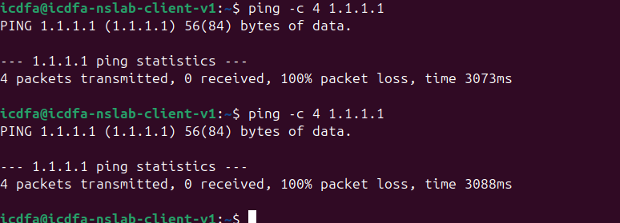

*Ping to 1.1.1.1 fails after the ICMP block rule is applied.*


I then checked that DNS and HTTPS were still available:

```bash
getent hosts example.com
curl -I https://example.com
```

Name resolution returned addresses, and HTTPS returned `HTTP/2 200`. Blocking ICMP to one destination did not block all internet traffic.

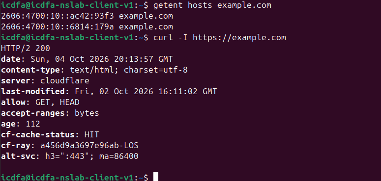

*DNS resolution and HTTPS remain successful while the ICMP rule is active.*


## Part D: Block outbound HTTP while allowing HTTPS

I added the second temporary rule, `LAB2 BLOCK OUTBOUND HTTP`, above the default allow rule.

| Rule field | Setting |
|---|---|
| Action | Block |
| Interface and direction | LAN, In |
| IP version | IPv4 |
| Protocol | TCP |
| Source | LAN network |
| Destination | Any |
| Destination port | HTTP, TCP port `80` |
| Logging | Enabled; matching entries appear in Live View |
| Description | `LAB2 BLOCK OUTBOUND HTTP` |

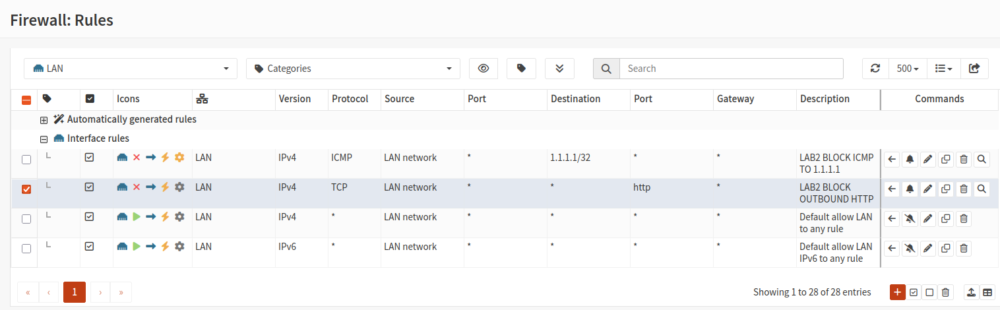

*Both temporary block rules appear above the default LAN allow rules.*


I compared the two web requests:

```bash
curl --max-time 10 -I http://example.com
curl --max-time 10 -I https://example.com
```

HTTP failed with `curl: (28) Connection timed out after 10003 milliseconds`. HTTPS returned `HTTP/2 200`. The result demonstrates the difference between blocking TCP port 80 and leaving TCP port 443 available.

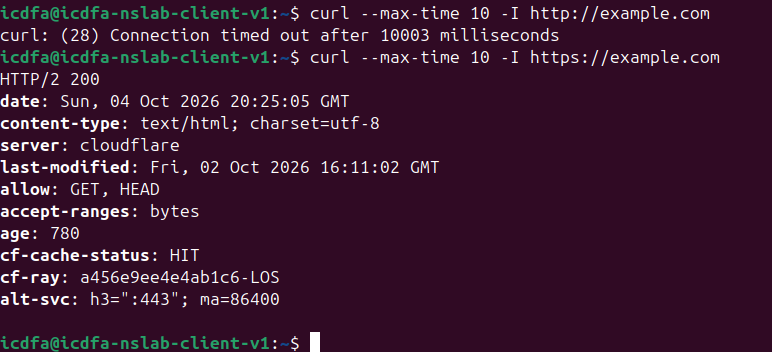

*HTTP times out while HTTPS returns a successful response.*


## Part E: Examine firewall logs

I opened **Firewall → Log Files → Live View** and inspected the entries produced by the tests. The screenshots include the general view and views filtered by the client address, destination `1.1.1.1`, destination port `80`, and HTTP rule description.

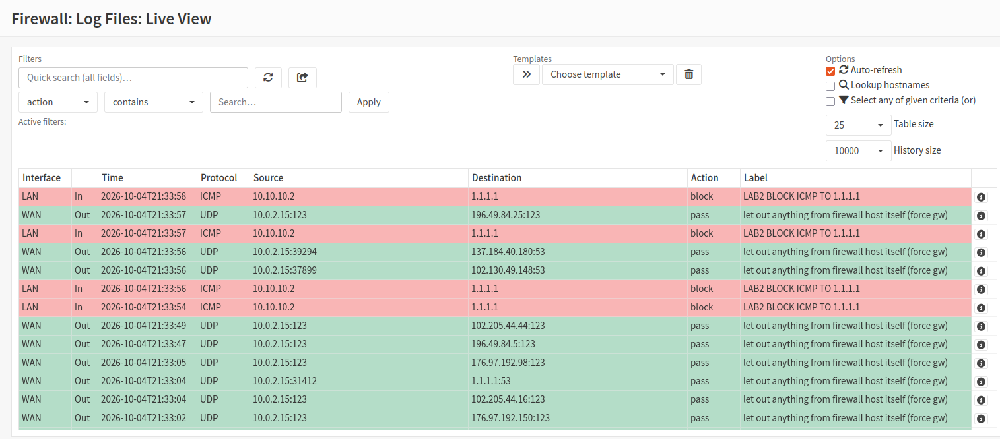

*Live View overview showing blocked LAN traffic and other logged traffic.*

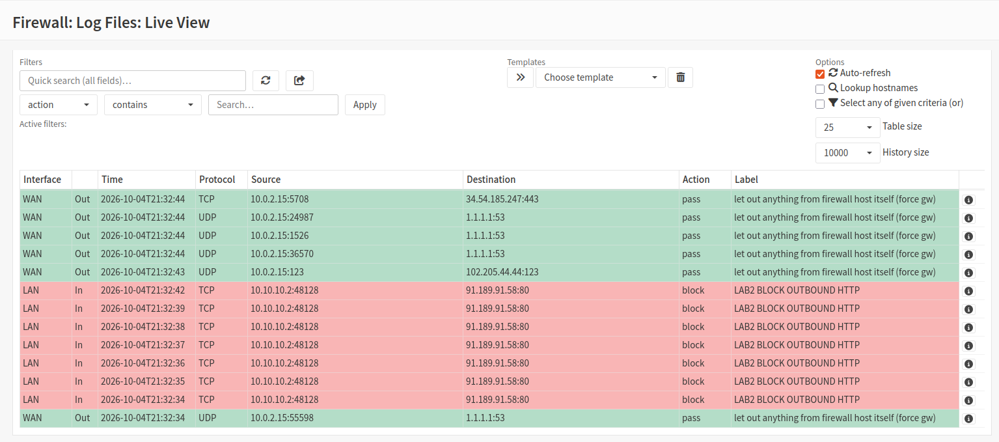

*Live View showing TCP port 80 packets blocked by the HTTP rule.*

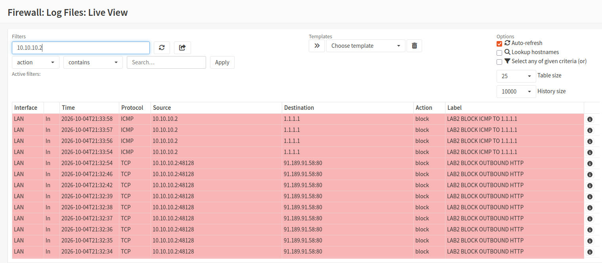

*Client-address search showing ICMP and HTTP blocks from 10.10.10.2.*

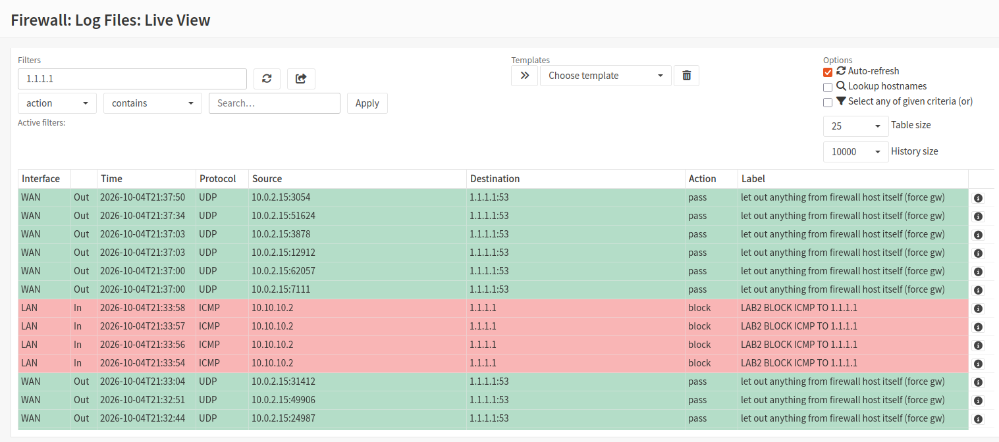

*Destination search for 1.1.1.1 showing the ICMP block entries.*

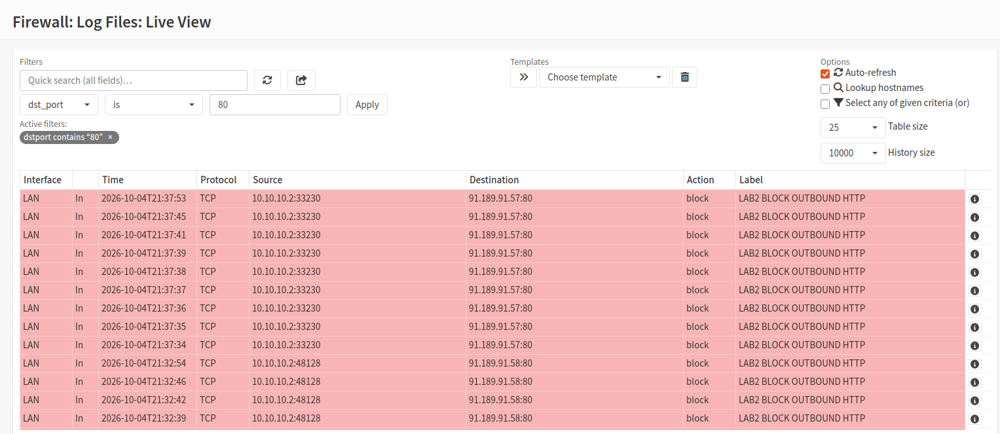

*Destination-port filter showing blocked TCP port 80 traffic.*

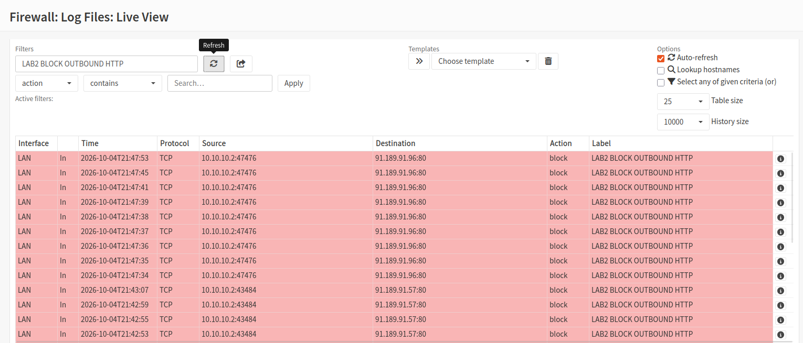

*Rule-description search showing entries for LAB2 BLOCK OUTBOUND HTTP.*


The client-filtered screenshot contains these example entries:

| Log field | ICMP example | HTTP example |
|---|---|---|
| Timestamp, as displayed | `2026-10-04T21:33:58` | `2026-10-04T21:32:54` |
| Interface | LAN | LAN |
| Direction | In | In |
| Source IP | `10.10.10.2` | `10.10.10.2` |
| Source port | Not applicable | `48128` |
| Destination IP | `1.1.1.1` | `91.189.91.58` |
| Destination port | Not applicable | `80` |
| Protocol | ICMP | TCP |
| Action | block | block |
| Rule label | `LAB2 BLOCK ICMP TO 1.1.1.1` | `LAB2 BLOCK OUTBOUND HTTP` |

The ICMP packets matched the protocol and destination of the first block rule. The HTTP packets matched the TCP destination port of the second rule. Both rules were above the broad default allow rule, so the matching traffic was blocked before that allow rule was reached.

## Part F: Correlate with Wireshark

I used Wireshark on `enp0s3` to inspect the traffic generated by the tests.

### Blocked ICMP

Display filter:

```text
icmp && ip.addr == 1.1.1.1
```

The capture shows four Echo Requests from `10.10.10.2` to `1.1.1.1`. No Echo Replies appear in the filtered view. This agrees with the failed ping and the ICMP block log entries.

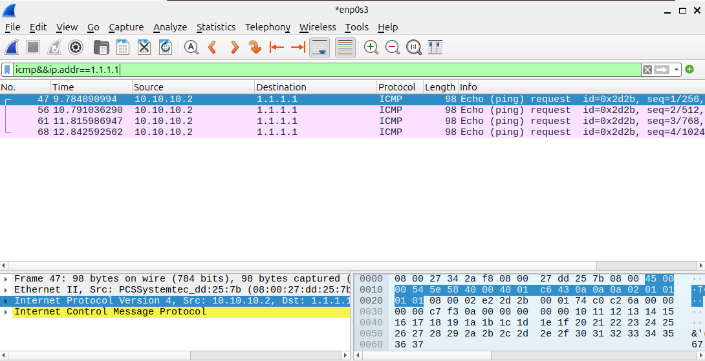

*Wireshark shows outgoing ICMP Echo Requests without Echo Replies.*


### Blocked HTTP

Display filter:

```text
tcp.dstport == 80
```

The screenshot shows TCP SYN packets and retransmissions from Ubuntu to destination port 80. The displayed attempts target `172.66.147.243` and `104.20.23.154`. Together with the HTTP timeout and firewall block logs, these observations illustrate connection attempts that receive no successful response.

The HTTP destination addresses in the Wireshark view differ from those in the displayed firewall log examples; the images document separate recorded attempts rather than a verified one-to-one packet match.

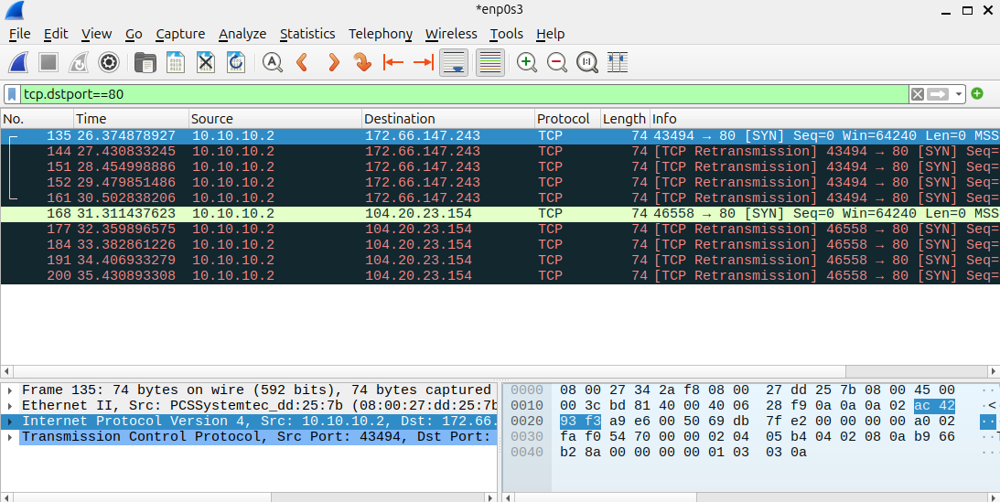

*Wireshark shows TCP port 80 SYN attempts and retransmissions.*


### Permitted HTTPS traffic

Display filter:

```text
tcp.port == 443
```

The supplied screenshot shows bidirectional TCP acknowledgements and TLSv1.2 Application Data between Ubuntu (`10.10.10.2`) and the local OPNsense interface (`10.10.10.1`). It demonstrates an active encrypted management connection. The visible rows do not show the initial TCP handshake or an external HTTPS connection to `example.com`; the successful external HTTPS result is recorded in the curl screenshots.

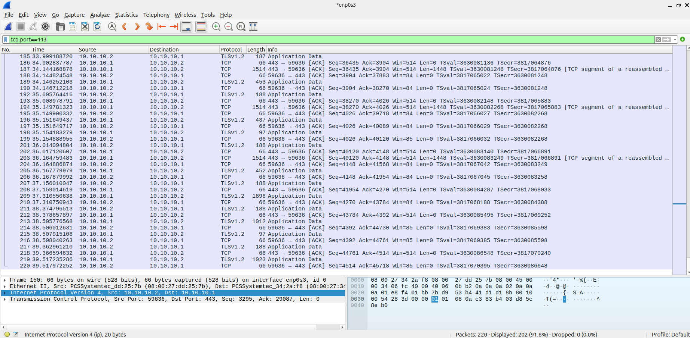

*Wireshark shows permitted local TCP port 443 traffic and TLS application data.*


## Part G: Inspect states and automatic NAT

I opened **Firewall → Diagnostics → States** and searched for `10.10.10.2`.

The first screenshot shows local TCP connections to `10.10.10.1:443`, including an established state, associated with the anti-lockout rule. The other view shows additional client TCP states targeting port 53, with `CLOSED:SYN_SENT` displayed.

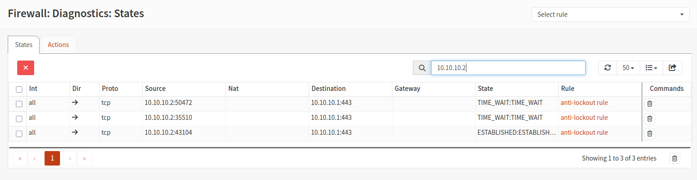

*Client-filtered state table showing local HTTPS connections to the firewall.*

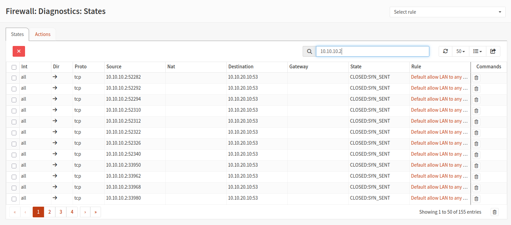

*Additional client states displayed in the firewall state table.*


The brief also requires checking **Firewall → NAT → Outbound**. Outbound NAT translates a private LAN source address when the client accesses the upstream network. The supplied screenshots do not show the outbound NAT mode or a translated WAN-side HTTPS state. The visible local management connections do not require outbound NAT.

## Part H: Restore the laboratory

I disabled the two temporary rules while retaining the default LAN allow rules. The final screenshot shows both LAB2 block rules greyed out.

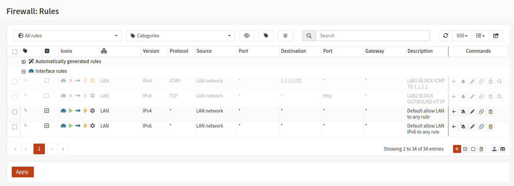

*Final LAN rules view showing the two temporary block rules disabled.*


The brief requests these tests after applying the restoration:

```bash
ping -c 4 1.1.1.1
curl --max-time 10 -I http://example.com
curl --max-time 10 -I https://example.com
```

The supplied final evidence shows the disabled rules, but does not include terminal results for these restored-connectivity tests.

## Analysis questions

### 1. Why must the specific block rules be placed above the broad allow rule?

The quick interface rules used in this laboratory are processed from top to bottom. If the broad allow rule matched first, it would allow the traffic before the intended block rule could take effect.

### 2. Which five packet attributes are most useful when explaining a firewall decision?

Source IP address, destination IP address, protocol, source port and destination port. These identify a TCP or UDP flow. ICMP does not use TCP/UDP ports; its type and code provide additional information. The interface, action and rule label establish where and why the decision occurred.

### 3. Why did blocking ICMP not block HTTPS?

The first rule matched IPv4 ICMP traffic to `1.1.1.1`. HTTPS uses TCP port 443 and therefore did not match that rule. The successful HTTPS output confirms it remained available during the test.

### 4. What difference did you observe between blocked TCP port 80 and permitted TCP port 443 traffic?

The HTTP request timed out, and its capture showed SYN retransmissions. HTTPS returned response headers, while the supplied local port 443 capture showed bidirectional TCP and encrypted TLS application data.

### 5. What role does outbound NAT play when the client uses a private IPv4 address?

Outbound NAT translates the client's private source address to the firewall's WAN address for upstream access and tracks the mapping for returning traffic. It is separate from the rules that decide whether the traffic is allowed or blocked.

### 6. Why is restoring the original state important in a controlled security laboratory?

Disabling the temporary restrictions returns the intended policy to its normal state and prevents test rules from affecting later activities. Retesting confirms whether connectivity has actually been restored.

## Conclusion

This laboratory helped me understand how rule order and protocol-specific conditions affect firewall decisions. I observed an ICMP block to one destination and an HTTP port 80 block while DNS and HTTPS remained available. Firewall logs identified the matching rules, and Wireshark showed unanswered Echo Requests, TCP SYN retransmissions and permitted encrypted traffic. Inspecting connection states and disabling the temporary rules completed the documented policy-testing process, while the screenshots distinguish the results actually recorded from the additional checks required by the brief.
